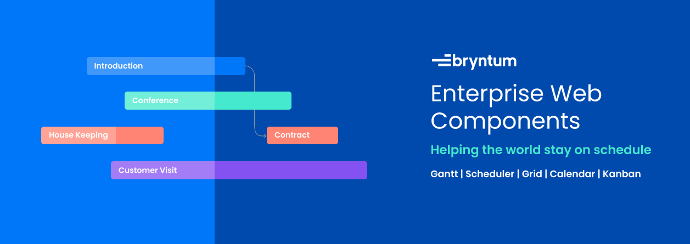

# What's Bryntum?

<a href="//bryntum.com">Bryntum</a> is a Swedish software company creating advanced JavaScript UI components for enterprise-grade web applications. Founded by a team of passionate web developers, Bryntum specializes in providing cutting-edge scheduling, resource management, and data visualization solutions for modern front-end frameworks. Learn more about our products below:

* <a href="//bryntum.com/products/grid">Grid</a>
* <a href="//bryntum.com/products/scheduler">Scheduler</a>
* <a href="//bryntum.com/products/scheduler-pro">Scheduler Pro</a>
* <a href="//bryntum.com/products/gantt">Gantt</a>
* <a href="//bryntum.com/products/calendar">Calendar</a>
* <a href="//bryntum.com/products/taskboard">Kanban Task Board</a>

## Bryntum support repo
This repo is an issues-only repository for the Bryntum JS library. If you find a bug, have suggestions for improvements, or want to request a new feature, please visit our official **[Bryntum Forum](https://forum.bryntum.com/)**. Here’s what to do:

1. **Search the Forum**  
   - Before posting, see if your issue or suggestion has already been discussed.

2. **Create a New Topic**  
   - If you can’t find an existing thread, create a new one.  
   - Provide a clear and concise title that summarizes your bug or feature request.

3. **Provide Details**  
   - **For Bug Reports**:  
     - Steps to reproduce the issue  
     - The version of Bryntum library and browser/environment  
     - Code snippets or test cases (if possible)  
   - **For Feature Requests**:  
     - A brief description of the feature  
     - A use case or example showing its benefits

4. **Engage with the Community**  
   - Check back often to respond to any follow-up questions from Bryntum’s team or other community members. 

## License
The Bryntum JS library is distributed under a commercial license. See Bryntum’s [license terms](//bryntum.com/licensing/) for additional information.

## Contact
If you have any questions, feel free to reach out to us through our [Contact form](//bryntum.com/contact).

## Build Statuses

For build statuses for our nightly builds, see our [Build status](//dev.bryntum.com/teamcity) page.

_Thank you for using Bryntum! We’re excited to see what you’ll build with our tools._
